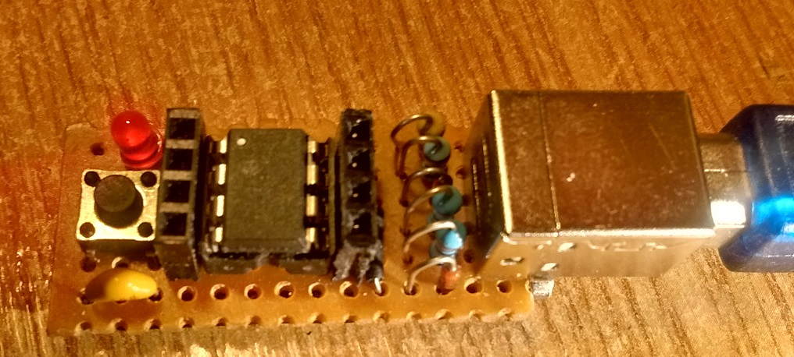

# Nanite-FPC

Nano-Sized ATtiny85 devboard with USB Bootloader ( NaniteLib ported to FreePascal )

Ported from https://github.com/cpldcpu/Nanite.

As described in his [blog post](http://cpldcpu.wordpress.com/2014/04/25/the-nanite-85/) the bootloader you should use is
the t85_default_entry_jumper_PB5.hex in the micronucleus directory.

The repository holds the micronucleus firmware, the micronucleus commandline, the windows USB driver and a software example in free pascal to handle the soft reset-button.

I made one using the through hole version from Danjovic (https://github.com/Danjovic/Nanite)
 on a veroboard for fun ... ;) 
 
 Works like a charm !!!!
 
 PS: FYI, I used a recent trunk Free Pascal ( 10/01/2020 ).

